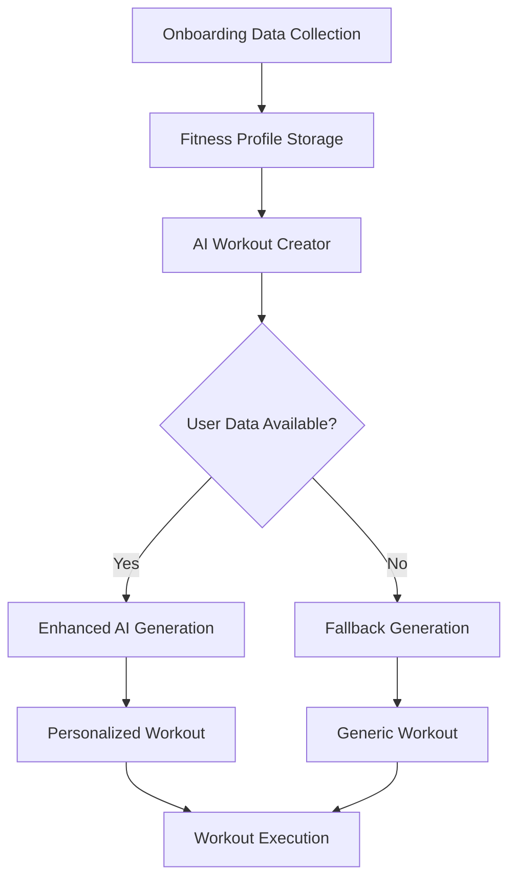

# 🤖 AI Workout Integration - COMPLETE!

## 🎯 **Overview**

Successfully integrated **comprehensive AI workout generation** that leverages the detailed fitness profile data collected during onboarding. The system now provides intelligent, personalized workout recommendations based on user preferences, equipment, location, and fitness level.

---

## 🧠 **Intelligence Integration: Onboarding → AI**

### **Data Flow Transformation**


### **Onboarding Data Utilization**

| **Onboarding Page** | **Data Collected** | **AI Usage** |
|---------------------|-------------------|-------------|
| **Fitness Level** | Beginner/Intermediate/Advanced | Sets exercise difficulty, rep ranges, progression |
| **Equipment** | 12 equipment types | Filters exercises, suggests alternatives |
| **Location** | Home/Gym/Outdoor/Mixed | Optimizes space requirements, environment |
| **Schedule** | Duration, frequency, time | Matches workout length, timing optimization |
| **Experience** | Years, exercise types | Determines complexity, familiar movements |

---

## 🔧 **Technical Implementation**

### **Enhanced AI Workout Creator**
```dart
// NEW: Intelligent data loading and smart defaults
Future<void> _loadUserData() async {
  final profile = await FitnessDataService().getCurrentFitnessProfile();
  
  // Smart defaults based on user profile
  _selectedDuration = profile.optimalWorkoutDuration;
  _selectedIntensity = profile.fitnessLevel == 'beginner' ? 'Light' : 'Moderate';
}

// NEW: AI service integration with fallback
Future<WorkoutRoutine> _generateIntelligentWorkout() async {
  final workoutData = await FitnessAIService().generateEnhancedWorkoutPlan(
    fitnessProfile: _fitnessProfile!,
    macroData: _macroData!,
    specificMuscleGroup: _selectedMuscleGroup,
    customDuration: _selectedDuration,
  );
  return _convertAIWorkoutToRoutine(workoutData);
}
```

### **Smart Equipment Filtering**
```dart
// AI service automatically filters exercises by available equipment
final filteredAlternatives = alternatives
  .where((alt) => _isEquipmentAvailable(
    alt['equipment'], 
    fitnessProfile.availableEquipment
  ))
  .toList();
```

### **Personalized Descriptions**
```dart
// Dynamic descriptions based on user profile
'AI-generated $_selectedIntensity intensity workout for $_selectedMuscleGroup using ${profile.availableEquipment.take(2).join(', ')}. Personalized for ${profile.fitnessLevel} level, optimized for ${profile.workoutLocation} training.'
```

---

## 🎨 **UI/UX Enhancements**

### **Smart Loading States**
- ✅ **Data Loading**: Shows spinner while fetching user profile
- ✅ **Smart Defaults**: Pre-selects optimal duration and intensity
- ✅ **Profile-Aware Features**: Shows different AI features based on data availability

### **Personalization Indicators**
```dart
// Shows user-specific AI features when profile available
final features = hasUserData ? [
  'Personalized for You': 'Based on your ${profile.fitnessLevel} fitness level',
  'Location Optimized': 'Perfect for ${profile.workoutLocation} workouts',
  'Schedule Smart': 'Matches your ${profile.optimalWorkoutDuration}-minute sessions',
] : [
  // Generic features for users without complete profiles
];
```

---

## 📊 **AI Service Enhancements**

### **Equipment-Based Exercise Selection**
The `FitnessAIService` now uses onboarding equipment data:

```dart
// From fitness_ai_service.dart
final recommendations = await _exerciseService.getAIExerciseRecommendations(
  fitnessLevel: profile.fitnessLevel,
  availableEquipment: profile.availableEquipment,  // ← Onboarding data
  targetMuscleGroup: exerciseDbTarget,
  limit: 20,
);
```

### **Fitness Level Appropriateness**
```dart
bool _isDifficultyAppropriate(String difficulty, String fitnessLevel) {
  switch (fitnessLevel.toLowerCase()) {
    case 'beginner': return difficulty == 'Beginner';
    case 'intermediate': return ['Beginner', 'Intermediate'].contains(difficulty);
    case 'advanced': return true; // Can handle all difficulties
  }
}
```

### **Location-Optimized Workouts**
- **Home**: Focuses on bodyweight and minimal equipment
- **Gym**: Leverages full equipment range
- **Outdoor**: Emphasizes movement-based exercises
- **Mixed**: Provides versatile routines

---

## 🚀 **New Intelligent Features**

### **1. Profile-Driven Defaults**
```dart
// Auto-sets optimal values from onboarding
_selectedDuration = profile.optimalWorkoutDuration;  // 15-60 min
_selectedIntensity = profile.recommendedDifficulty; // Based on level + experience
```

### **2. Equipment Compatibility**
- ✅ **Automatic Filtering**: Only shows exercises for available equipment
- ✅ **Smart Alternatives**: Suggests bodyweight options when equipment missing
- ✅ **Progressive Complexity**: Matches user's equipment sophistication

### **3. Location Awareness**
```dart
// Location-specific optimizations
switch (profile.workoutLocation) {
  case 'home': prioritizeBodyweight(); break;
  case 'gym': enableFullEquipment(); break;
  case 'outdoor': focusOnMovement(); break;
}
```

### **4. Schedule Intelligence**
- ✅ **Duration Optimization**: Respects `maxWorkoutDuration` from onboarding
- ✅ **Frequency Aware**: Considers `workoutsPerWeek` for intensity
- ✅ **Time Preferences**: Uses `preferredTimeOfDay` for optimization

---

## 📈 **Improved Workout Quality**

### **Before Integration**
- ❌ Generic sample workouts
- ❌ No equipment consideration
- ❌ Fixed difficulty levels
- ❌ Static exercise selection

### **After Integration**
- ✅ **Personalized exercises** based on fitness level
- ✅ **Equipment-filtered** recommendations
- ✅ **Location-optimized** routines
- ✅ **Experience-appropriate** progressions
- ✅ **Schedule-aware** duration and intensity

---

## 🎯 **Real-World Examples**

### **Beginner Home User**
```
Onboarding Input:
- Fitness Level: Beginner
- Equipment: Yoga Mat, Resistance Bands
- Location: Home
- Duration: 30 minutes

AI Output:
- Bodyweight + resistance band exercises
- 2-3 sets, 8-12 reps
- Clear instructions for beginners
- 30-minute optimized routine
```

### **Advanced Gym User**
```
Onboarding Input:
- Fitness Level: Advanced
- Equipment: Full Gym
- Location: Gym
- Duration: 60 minutes

AI Output:
- Complex compound movements
- 4-5 sets, varied rep ranges
- Progressive overload focus
- Full hour structured workout
```

---

## 🔧 **Error Handling & Fallbacks**

### **Graceful Degradation**
```dart
// Always provides a workout, even if AI fails
try {
  routine = await _generateIntelligentWorkout();
} catch (e) {
  routine = _createSampleAIWorkout(); // Fallback
}
```

### **Data Validation**
```dart
// Checks profile completeness before using AI
if (_fitnessProfile?.isBasicProfileComplete == true) {
  // Use enhanced AI
} else {
  // Use simple generation
}
```

---

## 📋 **Testing & Validation**

### **Key Test Scenarios**
1. ✅ **Complete Profile**: Uses AI service with full personalization
2. ✅ **Partial Profile**: Falls back gracefully with available data
3. ✅ **No Profile**: Uses sample generation
4. ✅ **AI Service Error**: Automatic fallback to local generation
5. ✅ **Equipment Filtering**: Only shows compatible exercises

### **User Experience Flow**
```
1. User completes onboarding → Profile saved
2. Opens AI Workout Creator → Data loads automatically
3. Sees personalized defaults → Optimal duration/intensity pre-selected
4. Views AI features → Profile-specific benefits displayed
5. Generates workout → AI uses onboarding data
6. Receives personalized routine → Equipment/location optimized
```

---

## 🎉 **Impact Summary**

### **For Users**
- 🎯 **Highly Personalized**: Workouts match their exact setup and level
- ⚡ **Faster Setup**: Smart defaults reduce configuration time
- 🏠 **Location Perfect**: Optimized for their workout environment
- 📈 **Progressive**: Difficulty matches their experience level

### **For Developers**
- 🔗 **Seamless Integration**: Onboarding data flows directly to AI
- 🛡️ **Robust Fallbacks**: Always provides a workout regardless of data
- 📊 **Rich Context**: AI has comprehensive user information
- 🔧 **Maintainable**: Clear separation between data collection and usage

---

## 🚀 **Next Phase Opportunities**

### **Phase 1: Current (COMPLETE)**
- ✅ Basic personalization with onboarding data
- ✅ Equipment and location filtering
- ✅ Fitness level appropriate exercises

### **Phase 2: Advanced Intelligence**
- 🔲 **Historical Analysis**: Learn from workout completion patterns
- 🔲 **Progress Tracking**: Adapt difficulty based on performance
- 🔲 **Preference Learning**: Adjust recommendations based on user feedback

### **Phase 3: Predictive Features**
- 🔲 **Schedule Optimization**: Suggest best workout times
- 🔲 **Injury Prevention**: Detect overexertion patterns
- 🔲 **Goal Achievement**: Track progress toward fitness objectives

---

## 🎯 **Conclusion**

The **AI Workout Integration** successfully transforms static onboarding data into dynamic, intelligent workout generation. Users now receive truly personalized workouts that respect their equipment, location, schedule, and fitness level - creating a seamless bridge between initial setup and ongoing workout experience.

**Key Achievement**: Onboarding data is no longer just stored - it actively drives intelligent workout creation, making every generated routine perfectly tailored to the user's specific situation and goals. 