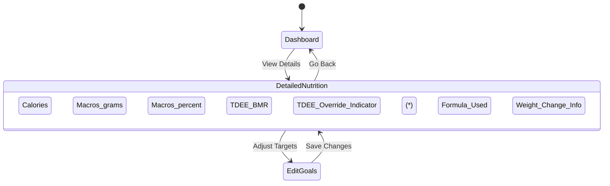

# Recommendations for Displaying Calculated Macro Targets

Based on the analysis of `MacroCalculatorService` changes (commit `8018b3f`) and the onboarding flow, this document outlines recommendations for displaying calculated daily macro targets (Calories, Protein, Carbs, Fat) within the MacroTracker application. The goal is to optimize for user engagement, clarity, accessibility, task completion speed, and conversion rate.

## 1. Key Information to Display

The core information derived from `MacroCalculatorService` results includes:

*   **Primary:**
    *   Target Calories
    *   Target Protein (g)
    *   Target Carbs (g)
    *   Target Fat (g)
*   **Secondary (Contextual):**
    *   Macro Percentages (P/C/F %)
    *   TDEE (Total Daily Energy Expenditure) - *Crucially indicating if manually overridden*
    *   BMR (Basal Metabolic Rate)
    *   BMR Formula Used (e.g., Mifflin-St Jeor, Katch-McArdle)
    *   Estimated Weekly Weight Change (kg/lbs)
    *   Estimated Time/Date to Reach Goal Weight (if applicable)

## 2. UI/UX Recommendations

### A. Dashboard / Home Screen (High-Level View)

*   **Goal:** Provide a quick, scannable overview of daily targets and progress.
*   **Display:**
    *   **Target Calories:** Most prominent value.
    *   **Macro Breakdown (Grams):** Clearly display Protein, Carb, and Fat targets in grams. Use distinct sections, cards, or a clear list format.
    *   **Progress Visualization:** Integrate progress tracking (consumed vs. target) using intuitive visuals like:
        *   Circular progress indicators (one for overall calories, potentially smaller ones for each macro).
        *   Segmented progress bars.
        *   This directly impacts engagement and task completion speed (logging food).
    *   **Compactness:** Keep the initial view concise. Consider allowing users to tap/expand sections for more details if needed.

```mermaid
graph LR
    A[User Opens App] --> B(Dashboard Screen);
    B --> C{Calories Target};
    B --> D{Macro Targets (g)};
    C --> E[Progress Ring/Bar];
    D -- Protein --> F[P Progress];
    D -- Carbs --> G[C Progress];
    D -- Fat --> H[F Progress];
    style E fill:#f9f,stroke:#333,stroke-width:2px
    style F fill:#ccf,stroke:#333,stroke-width:2px
    style G fill:#fcc,stroke:#333,stroke-width:2px
    style H fill:#ffc,stroke:#333,stroke-width:2px
```

### B. Dedicated Nutrition / Goals Screen (Detailed View)

*   **Goal:** Offer a comprehensive breakdown of how targets were derived and provide easy access to adjustments.
*   **Display:**
    *   Repeat primary target info (Calories, Macros in grams) for consistency.
    *   **Macro Percentages:** Show the P/C/F breakdown as percentages (e.g., using a Pie chart, bar chart, or simple list).
    *   **Energy Breakdown:** Display the calculated/used TDEE and BMR values.
    *   **TDEE Override Indicator:** **Clearly indicate** if the TDEE value was manually set by the user (e.g., "Manual TDEE: 2500 kcal", an icon + tooltip explaining it overrides the calculation). This is vital for clarity.
    *   **Formula Info:** Show the BMR formula used for calculation (e.g., "Formula: Mifflin-St Jeor").
    *   **Weight Goal Context:** Display the estimated weekly weight change and projected goal date (if applicable and calculated).
    *   **Easy Editing:** Provide clear buttons or links (e.g., "Edit Goals", "Adjust Activity") to navigate users directly to the relevant settings screens to modify goals, activity level, TDEE override, or advanced macro ratios. This improves task completion speed for goal adjustments.



### C. General UI/UX Considerations

*   **Clarity & Readability:** Use clear, unambiguous labels (e.g., "Target Calories", "Protein Target"). Employ strong typography hierarchy. Avoid jargon where possible or explain it (tooltips).
*   **Visual Aids:** Use color-coding consistently for macros (e.g., Blue for Protein, Red for Carbs, Yellow for Fat) across charts, progress bars, and potentially food logs. Ensure chosen colors have sufficient contrast for accessibility.
*   **Accessibility:**
    *   Use semantic labels for all interactive elements and data points for screen reader compatibility.
    *   Ensure tap targets are large enough (min 44x44dp).
    *   Leverage tooltips (like the new `TooltipIcon` widget) for abbreviations (TDEE, BMR) or less common terms.
*   **Interactivity:** Make progress indicators visually responsive and satisfying as users log food throughout the day. Consider subtle animations.

## 3. Implementation Notes

*   These recommendations should be implemented primarily in the main dashboard/tracking screen and a dedicated nutrition/goals detail screen.
*   The `ResultsScreen` shown after onboarding can present a simplified version of the detailed view.
*   Ensure data flows correctly from `MacroCalculatorService` and user settings (`user_macros` table / local storage) to these UI components.